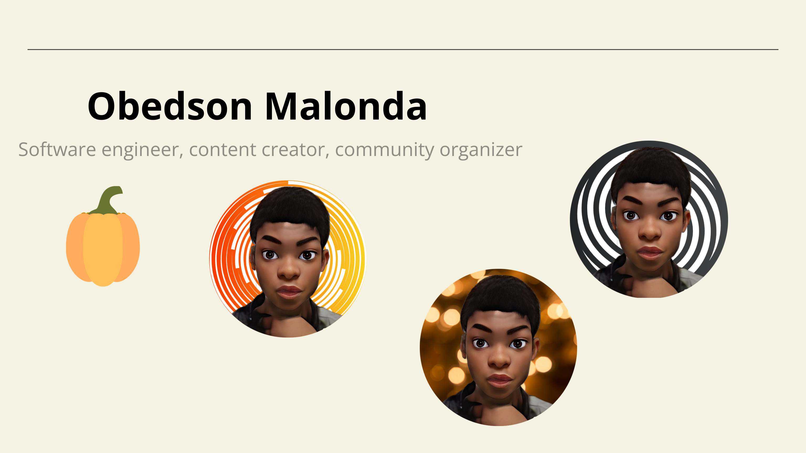

# Hi, I'm Obedson Malonda 👋🏾 👩🏾‍💻

I'm a software engineer who is passionate about making contributing to open-source more approachable, creating technology to elevate people, and building community. Some technologies I enjoy working with include ReactJS, Jamstack (JavaScript, APIs + Markup) and GraphQL, PHP, Python and all the tech existing in the wolrd.

jobs:
  publish:
    runs-on: ubuntu-latest
    steps:
      - uses: actions/checkout@master
        with:
          persist-credentials: false
          fetch-depth: 0
      - name: Create README.md
        uses: actions-js/profile-readme@master
        with:
          username: <your username>
          github_token: ${{ secrets.GITHUB_TOKEN }}
      - name: Commit & Push changes
        uses: actions-js/push@master
        with:
          github_token: ${{ secrets.GITHUB_TOKEN }}
